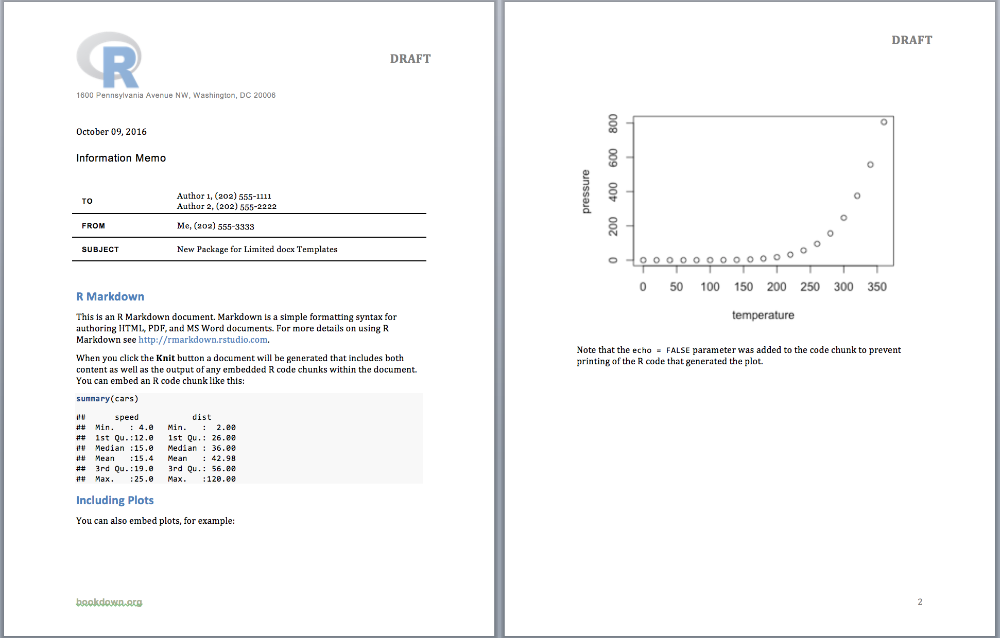
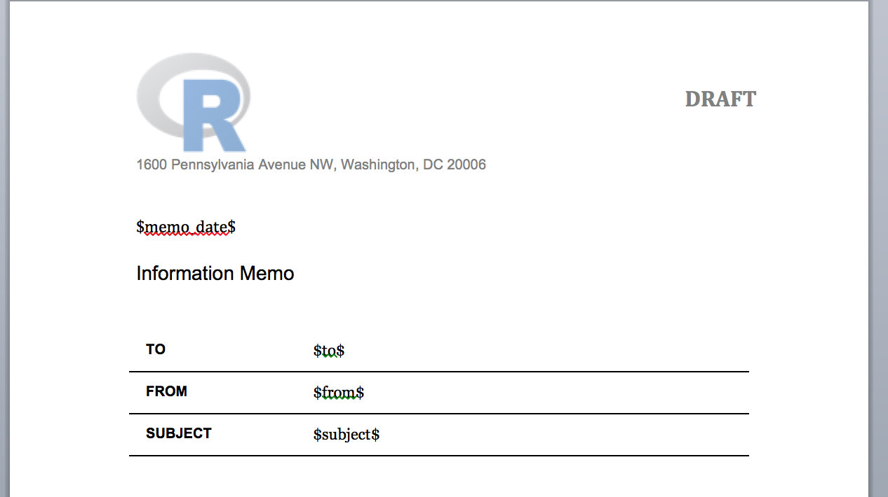

Yihui Xie's R packages for reproducible research (including [knitr](http://yihui.name/knitr/), [rmarkdown](http://rmarkdown.rstudio.com/), and [bookdown](https://bookdown.org/)) make implementing a reproducible workflow relatively easy.
While users of these packages can create templates to customize HTML or LaTeX output, there is no similar capability for working with Microsoft Word's docx format.
For most users this should not provide a problem.
After all, who really wants to use Microsoft Word to publish statistic analyses?

While ragging on Microsoft Word can be fun, the fact remains that it is used by millions as their word processing software of choice.
For users, like me, who work in organizations that rely heavily on Word, documents are expected to be generated in Word using templates created to provide a consistent look and feel.
Even if the look and feel can be replicated using LaTeX, documents frequently have to be circulated among internal stakeholders for comment and the standard way of doing this is Word's "track changes" tools.
LaTeX and HTML do not offer the same easy way of making comments, which would require reverting to a paper-based commenting system or using PDFs and the less user-friendly tools provided by Adobe.

The `rocx` package was written to help bridge this gap for users who need to produce documents in the docx format using a particular look and feel.
By specifying the output format in the YAML header as `rocx::rocx` and providing a `reference_docx` file that contains the template, users can generate files directly from R that look like the following.

```{r echo = FALSE, fig.width = 4}
if ('png' %in% rownames(installed.packages())) {
  img <- png::readPNG('sample_rocx_output.png')
  grid::grid.raster(img)
} else {
  print('')
}
```

# Using `rocx`

The first step in creating a `rocx` template is to prepare a `reference_docx`, similar to those used already in R Markdown.
For those not familiar with this process, I highly recommend Richard Layton's [tutorial](http://rmarkdown.rstudio.com/articles_docx.html). 

When you have a `reference_docx` that works with `rmarkdown`, you can edit it to include text that you would like included in your document.
For example, the `rocx` package was primarily written to generate memos in the format used in my organization.
The `reference_docx` I used looked something like the following (with my organization's logo and address replaced), which was used to generate the output above.

```{r echo = FALSE, fig.width = 4}
if ('png' %in% rownames(installed.packages())) {
  img <- png::readPNG('sample_rocx_template.png')
  grid::grid.raster(img)
} else {
  print('')
}
```

This text includes the material that should be printed at the top of the memo, using the right spacing and formatting.
It also includes several variables, such as `$memo_date$`, `$from$`, and `$to$`.  
Like the templates one can create for HTML and LaTeX, these are variables that can be specified in the YAML header in the R Markdown file.
For example, the YAML header can be specified as below.

```
---
to:
- "Author 1, (202) 555-1111"
- "Author 2, (202) 555-2222"
from: "Me, (202) 555-3333"
memo_date: "`r format(Sys.Date(), '%B %d, %Y')`"
subject: "New Package for Limited docx Templates"
output: 
  rocx::rocx:
    reference_docx: "rocx_test.docx"
---
```

When the final output is prepared, `rocx` will search the tamplate for the variables specified in the YAML header and replace them when found.  There are a few important caveats about the use of variables in the template file.

* All variables in the template must begin and end with a `$`
* Some YAML variable names are expected by `knitr` and are handled in a specific way.  These include `author`, `title`, and `date`.  While one could use these as variable names in the template, if found, `knitr` will automatically print these at the top of the document.  Unless that is what the user prefers, it is best to avoid these variable names when working with `rocx`
* When creating the template `reference_docx`, each variable must appear as its own paragraph (a line by itself or a table cell).  It is not possible, for example to define a template variable that is within a line of text.  For example, if `"Hello, my name is $my_name$ and it is nice to meet you"` is included in the text of the template `reference_docx`, `$my_name$` will not be replaced even if it is a variable defined in the YAML header.  (This is a feature I am hoping to add in the future.)

The final step to use `rocx` is to indicate in your R Markdown document where you would like the material from the template to appear.  
To mark the location, add the text `&HEADER&` to your document in the desired location.
When creating memos, for example, one would put the header marker at the top of the document as follows.

```
---
to:
- "Author 1, (202) 555-1111"
- "Author 2, (202) 555-2222"
from: "Me, (202) 555-3333"
memo_date: "`r format(Sys.Date(), '%B %d, %Y')`"
subject: "New Package for Limited docx Templates"
output: 
  rocx::rocx:
    reference_docx: "rocx_test.docx"
---

&HEADER&

## R Markdown

This is an R Markdown document. Markdown is a simple formatting syntax for authoring HTML, PDF, and MS Word documents. For more details on using R Markdown see <http://rmarkdown.rstudio.com>.
...
```

Once the R Markdown document has been prepared, simply press the `Knit` button in RStudio or run the `rmarkdown::render` function to generate the docx file depicted at the beginning of this vignette.

# Other `rocx` Options

The `rocx::rocx` function also accepts the following arguments which can be specified in the YAML header.

## `draft`

If your document includes in the header text that labels the memo as a draft, `rocx` can remove this by setting `draft: false`.  
The draft notification will then be reduced from all headers in which it appears.

## `keep_old`

In some cases, users may wish to retain the original docx file generated by `rmarkdown` or `bookdown`.  
This can be done by setting `keep_old: true`.
If the file being knit is called `file_name`, the original knit file will be saved as `file_name_old.docx`.


